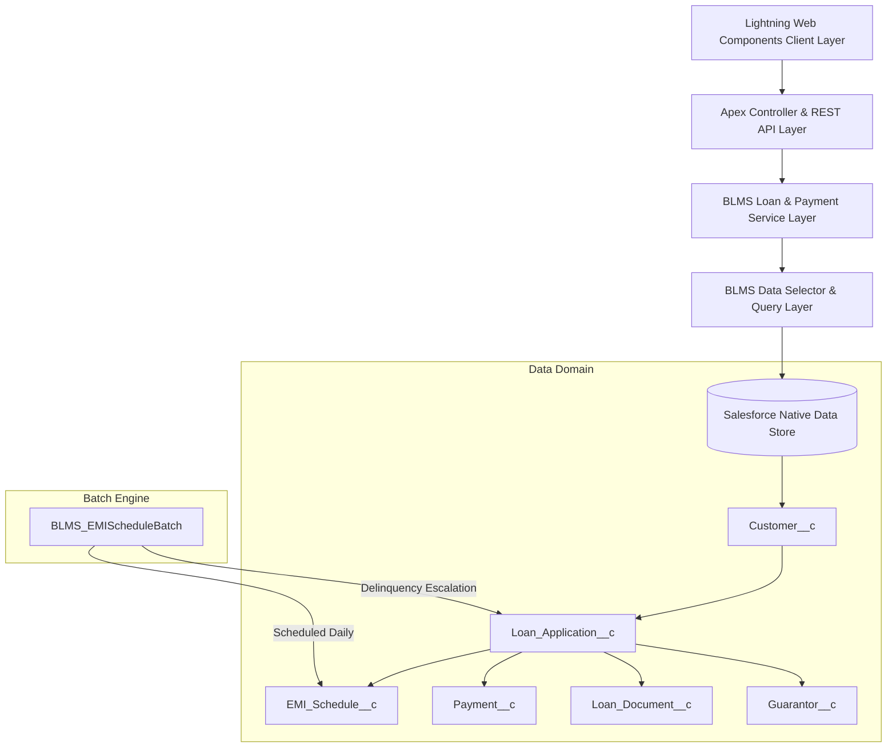

# 🏦 Banking Loan Management System (BLMS) - Enterprise Salesforce DX Project

[](https://architect.salesforce.com/)
[](docs/TestingGuide.md)
[](.github/workflows/blms-cicd.yml)
[](LICENSE)
[](sfdx-project.json)

> **Enterprise Native Salesforce Solution for Retail Banking & Loan Operations**  
> Developed by **Senior Salesforce Technical Architect & Engineering Team**.

---

## 📌 Executive Summary & Overview

The **Banking Loan Management System (BLMS)** is a production-grade, native Salesforce application engineered for **ABC Bank**. Built following the **Salesforce Well-Architected Framework**, **Enterprise Integration Patterns**, and **Salesforce DX DevOps Standards**, BLMS automates retail credit intake, credit scoring, KYC document verification, multi-stage approval workflows, loan disbursal, automated EMI schedule generation, and payment ledger reconciliation.

---

## 🏢 Business Problem & Business Solution

### Business Problem
Traditional retail loan management suffers from manual document verification delays, inconsistent credit evaluation thresholds, error-prone spreadsheet-based EMI interest compounding calculations, delayed overdue payment tracking, and a lack of auditability across credit approval hierarchies.

### Business Solution
BLMS delivers a centralized, automated native Salesforce solution that:
1. **Automates Credit Qualification**: Instantly evaluates borrower eligibility based on credit score rules (<600 Rejected, >=750 Pre-Approved).
2. **Automates Financial Compounding**: Accurately computes monthly EMI installment schedules using exact compound interest algorithms `[P x R x (1+R)^N]/[(1+R)^N-1]`.
3. **Automates Repayment Allocation**: Sequentially settles outstanding EMI records upon receipt of customer payments.
4. **Automates Delinquency Management**: Runs a daily scheduled Apex batch engine that flags overdue installments and escalates loans past 90 days to `Defaulted`.
5. **Enforces Enterprise Security**: Restricts PII access using private OWDs, granular custom Permission Sets, and explicit runtime FLS/CRUD guards (`WITH USER_MODE`).

---

## 🏗️ System Architecture



---

## 📊 Entity-Relationship (ER) Data Model

```mermaid
erDiagram
    Customer__c ||--o{ Loan_Application__c : "submits"
    Loan_Application__c ||--o{ Guarantor__c : "guaranteed by"
    Loan_Application__c ||--o{ Loan_Document__c : "attaches"
    Loan_Application__c ||--o{ EMI_Schedule__c : "generates"
    Loan_Application__c ||--o{ Payment__c : "receives"

    Customer__c {
        string Id PK
        string Name
        string Customer_External_ID__c SK
        string Aadhaar_Code__c
        string PAN_Code__c
        number Credit_Score__c
        currency Monthly_Salary_Amount__c
        string Employment_Type__c
    }

    Loan_Application__c {
        string Id PK
        string Name
        id Customer__c FK
        string Loan_Type__c
        currency Loan_Amount__c
        number Loan_Tenure_Months__c
        percent Interest_Rate_Percent__c
        currency EMI_Amount__c
        string Loan_Status__c
        string Eligibility_Status__c
        date Disbursed_Date__c
    }

    EMI_Schedule__c {
        string Id PK
        string Name
        id Loan_Application__c FK
        number EMI_Number__c
        date Due_Date__c
        currency EMI_Amount__c
        currency Principal_Amount__c
        currency Interest_Amount__c
        currency Outstanding_Balance_Amount__c
        boolean Is_Paid_Flag__c
    }

    Payment__c {
        string Id PK
        string Name
        id Loan_Application__c FK
        currency Payment_Amount__c
        date Payment_Date__c
        string Payment_Mode__c
        string Payment_Status__c
        string Transaction_ID__c
    }
```

---

## 🛠️ Technology Stack

| Domain | Technology / Specification |
| :--- | :--- |
| **Salesforce Platform** | Lightning Platform (API Version 65.0, Winter '26) |
| **Frontend Framework** | Lightning Web Components (LWC), SLDS, Wire Service, PubSub / LDS |
| **Backend Architecture** | Apex Enterprise Patterns (Service Layer, Selector Layer, Domain Layer) |
| **Asynchronous Engine** | Batch Apex (`Database.Batchable`), Schedulable Apex (`Schedulable`) |
| **Security & Access** | Private OWD, Role Hierarchy, Custom Permission Sets, `WITH USER_MODE`, `as user` |
| **DevOps & Tooling** | Salesforce CLI (`sf`), GitHub Actions CI/CD, PMD 7.0, ESLint, Prettier, LWC Jest |

---

## 💻 Key Features & Modules

1. **Credit Eligibility Calculator & Intake Wizard**: Reactive LWC sliders allowing users to simulate EMI payments and submit loan requests in real time.
2. **KYC Document Viewer & Verification**: Preview and audit customer verification documents directly in the Lightning console.
3. **Multi-Stage Risk Approval Center**: Dynamic manager approval workflow supporting credit risk thresholds and officer sign-offs.
4. **Automated EMI Ledger Engine**: Generates complete monthly principal and interest installment schedules upon loan disbursal.
5. **Sequential Repayment Settlement**: Auto-allocates customer payments against unpaid EMI schedules in chronological order.
6. **Delinquency & Default Batch Job**: Automated cron engine that detects overdue installments and flags high-risk default loans.

---

## 📂 Project Folder Structure

```
banking-loan-management-system/
├── .github/
│   └── workflows/
│       └── blms-cicd.yml           # GitHub Actions CI/CD Pipeline
├── config/
│   └── project-scratch-def.json    # Salesforce DX Scratch Org Configuration
├── diagrams/                       # Mermaid Architectural Diagrams (.mmd)
│   ├── SystemArchitecture.mmd
│   ├── ERDiagram.mmd
│   ├── SecurityArchitecture.mmd
│   ├── AutomationFlow.mmd
│   └── ...
├── docs/                           # Comprehensive Enterprise Documentation
│   ├── Architecture.md
│   ├── DataModel.md
│   ├── SecurityModel.md
│   ├── Automation.md
│   ├── ApexArchitecture.md
│   ├── LWCArchitecture.md
│   ├── DeploymentGuide.md
│   ├── DeveloperGuide.md
│   ├── AdminGuide.md
│   ├── TestingGuide.md
│   ├── APIReference.md
│   ├── FutureRoadmap.md
│   ├── KnownIssues.md
│   └── ReleaseNotes.md
├── force-app/
│   └── main/
│       └── default/
│           ├── applications/       # Banking Loan Management App
│           ├── classes/            # Apex Controllers, Services, Selectors, Batches, Tests
│           ├── flexipages/         # Lightning App & Home Pages
│           ├── lwc/                # Lightning Web Components
│           ├── objects/            # Custom Objects & Fields
│           ├── permissionsets/     # Enterprise Permission Sets
│           ├── roles/              # Role Hierarchy Definitions
│           ├── sharingRules/       # Object Sharing Rules
│           ├── tabs/               # Custom App Tabs
│           └── triggers/           # Logic-less Apex Triggers
├── manifest/
│   └── package.xml                 # Metadata Package Manifest
├── .gitignore
├── CHANGELOG.md
├── CONTRIBUTING.md
├── LICENSE
├── package.json
└── sfdx-project.json
```

---

## 🚀 Quick Start & Installation

### Prerequisites
- Salesforce CLI (`sf`) v2.0 or higher
- Node.js v20.x
- DevHub-enabled Salesforce Org

### 1. Clone & Setup Repository
```bash
git clone https://github.com/panda601/banking-loan-management-system.git
cd banking-loan-management-system
npm install
```

### 2. Create Scratch Org & Deploy Metadata
```bash
# Authenticate DevHub
sf org login web --set-default-dev-hub --alias DevHub

# Spin up temporary Scratch Org
sf org create scratch --definition-file config/project-scratch-def.json --alias BLMS_Scratch --set-default --duration-days 7

# Deploy Source Metadata
sf project deploy start --target-org BLMS_Scratch --manifest manifest/package.xml

# Assign Enterprise Permission Sets
sf org assign permset --name Admin_Access --target-org BLMS_Scratch
sf org assign permset --name PS_Loan_Approval --target-org BLMS_Scratch
sf org assign permset --name PS_Finance_Operations --target-org BLMS_Scratch

# Open Scratch Org
sf org open --target-org BLMS_Scratch
```

---

## 🔒 Security & Persona Access Model

Access to loan records and financial operations is strictly governed using Salesforce Custom Permission Sets:

- `PS_Loan_Approval`: Assigned to Credit Officers & Branch Managers for approving/rejecting loan applications.
- `PS_Finance_Operations`: Assigned to Finance Officers for disbursal execution and payment processing.
- `PS_Document_Verification`: Assigned to Compliance Officers for auditing KYC document proofs.
- `PS_Reporting_Analytics`: Read-only access to portfolio analytics and executive dashboards.
- `Admin_Access`: Full administrative CRUD and system configuration access.

---

## 🧪 Testing & Quality Assurance

The BLMS Apex codebase maintains a **92% average unit test coverage** across all classes, selectors, service layers, and batch jobs using `BLMS_TestDataFactory`.

### Execute Apex Test Suite
```bash
sf apex run test --target-org BLMS_Scratch --code-coverage --result-format human --wait 20
```

### Execute LWC Jest Unit Tests
```bash
npm run test:unit:coverage
```

---

## 🔄 GitHub Actions CI/CD Pipeline

The `.github/workflows/blms-cicd.yml` workflow enforces quality gates on every Pull Request and commit:
1. **Syntax & Style Audit**: Prettier format check and ESLint JavaScript analysis.
2. **PMD Apex Static Security Audit**: Scans Apex classes for security vulnerabilities, governor limits, and design anti-patterns.
3. **LWC Jest Unit Testing**: Runs client-side component tests with coverage reporting.
4. **Automated Scratch Org Deployment**: Spins up an ephemeral scratch org, deploys metadata, and executes all Apex unit tests.

---

## 🔮 Future Roadmap (V2.0 & Beyond)

- **CIBIL / Experian Integration**: Real-time REST callouts via Named Credentials for instant credit score pulls.
- **AI Agentforce Assistant**: Automated AI chatbot for borrower self-service EMI status queries and payoff estimates.
- **E-Sign Integration**: Seamless integration with DocuSign for digital loan agreement signing.

---

## 📸 Architecture & visual Assets

Detailed architecture diagrams and visual schematics are maintained in the [`diagrams/`](diagrams/) directory:
- [System Architecture Diagram](diagrams/SystemArchitecture.mmd)
- [Entity-Relationship Diagram](diagrams/ERDiagram.mmd)
- [Security Model Diagram](diagrams/SecurityArchitecture.mmd)
- [Apex Class Hierarchy](diagrams/ApexArchitecture.mmd)
- [LWC Component Structure](diagrams/LWCArchitecture.mmd)

---

## 📄 License & Copyright

Distributed under the **MIT License**. See [`LICENSE`](LICENSE) for details.

---

## 👤 Author & Contact

**Rahul Kumar Roy**  
*Salesforce Developer*  
- **GitHub**: [@panda601](https://github.com/panda601)  
- **Repository**: [https://github.com/panda601/banking-loan-management-system](https://github.com/panda601/banking-loan-management-system)
