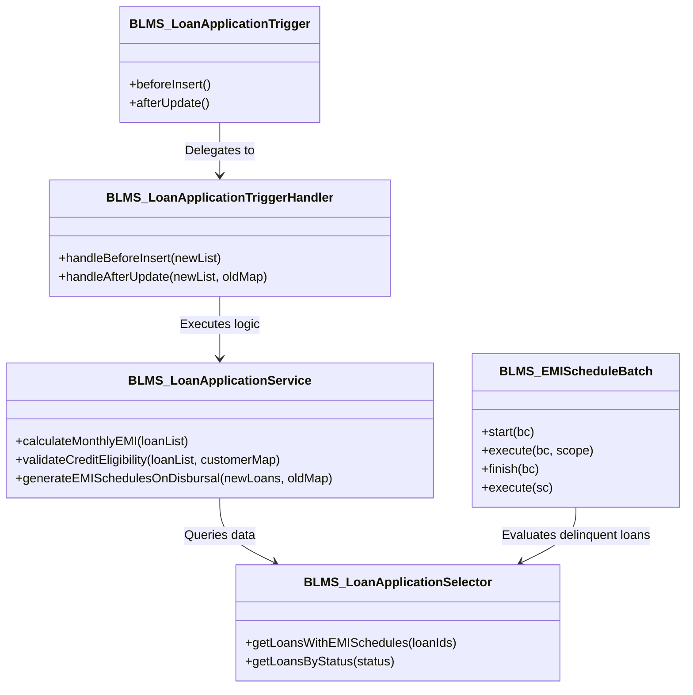

# Apex Backend Architecture - BLMS

## Overview
The backend architecture follows Enterprise Apex Patterns comprising Trigger Handlers, Service Layer classes, Selector query classes, Batchable/Schedulable jobs, and Test Factories.

---

## 1. Class Architecture Diagram

---

## 2. Apex Inventory

| Class Name | Type | Description |
| :--- | :--- | :--- |
| `BLMS_LoanApplicationService` | Service Class | Financial EMI calculation formula, credit scoring evaluation, EMI generation on disbursal |
| `BLMS_LoanApplicationSelector` | Selector Class | Optimized SOQL queries with `WITH USER_MODE` for loan records and relationships |
| `BLMS_LoanApplicationTriggerHandler` | Handler Class | Logic-less handler for `BLMS_LoanApplicationTrigger` |
| `BLMS_PaymentService` | Service Class | Handles incoming payment allocation against unpaid EMI schedules |
| `BLMS_PaymentTriggerHandler` | Handler Class | Logic-less handler for `BLMS_PaymentTrigger` |
| `BLMS_EMIScheduleBatch` | Batch & Schedule | Daily cron job detecting overdue EMIs and updating loan status to `Defaulted` (>90 days) |
| `BLMS_TestDataFactory` | Test Factory | Centralized mock generator for Customers, Loans, Guarantors, Documents, and Payments |
| `BLMS_LoanApplicationTriggerTest` | Test Class | Unit testing for loan triggers and lifecycle transitions |
| `BLMS_LoanServiceTest` | Test Class | Unit testing for loan service routines and credit formulas |
| `BLMS_PaymentTriggerTest` | Test Class | Unit testing for payment processing and installment allocation |
| `BLMS_EMIScheduleBatchTest` | Test Class | Unit testing for overdue EMI batch job execution |
