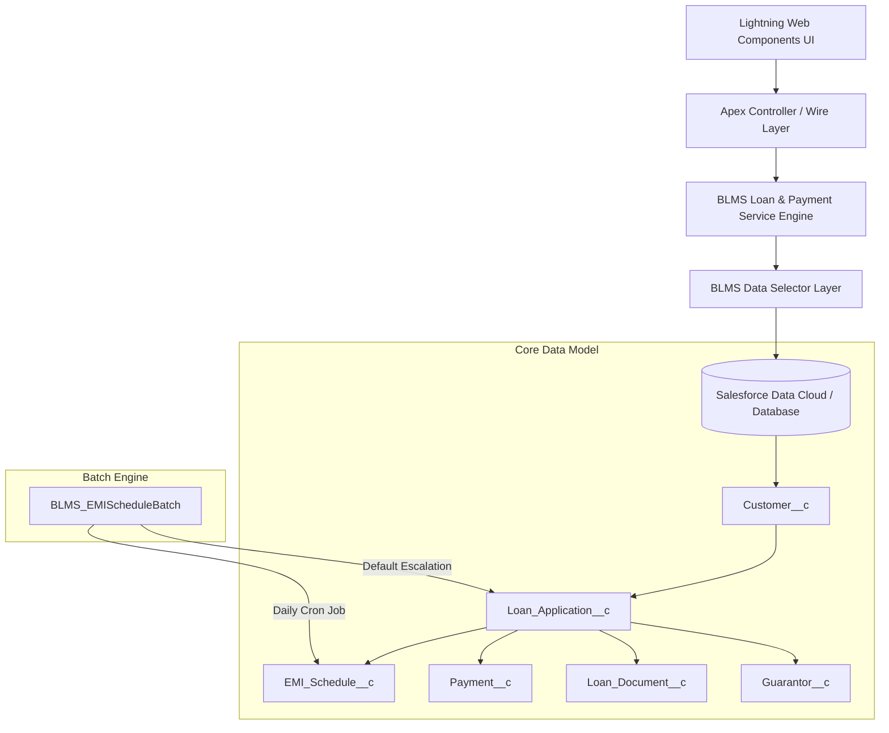

# System Architecture Document - Banking Loan Management System (BLMS)

## Executive Overview
The **Banking Loan Management System (BLMS)** is an enterprise-grade native Salesforce solution designed for retail banking institutions. It manages end-to-end loan lifecycles—from intake and automated credit qualification to KYC document verification, multi-tier manager approval workflows, financial disbursal, automated EMI schedule creation, and payment ledger reconciliation.

---

## 1. Enterprise System Architecture

---

## 2. Key Architecture Principles

1. **Separation of Concerns (SOC)**: Strict separation into UI Components (LWC), Application Service Layer (`BLMS_LoanApplicationService`, `BLMS_PaymentService`), Selector Query Layer (`BLMS_LoanApplicationSelector`), and Domain Data Models.
2. **Security First**: Enforced `with sharing` across all classes, explicit CRUD/FLS validation via `WITH USER_MODE`, and system-level permissions via dedicated Permission Sets.
3. **High Performance & Bulkification**: Zero SOQL queries or DML statements inside loops, set-based query execution, and batch processing for heavy data operations.
4. **DevOps Automation**: Native integration with Salesforce DX (`sf`), Scratch Orgs, GitHub Actions CI/CD pipelines, PMD static analysis, ESLint, and Prettier code formatting.
