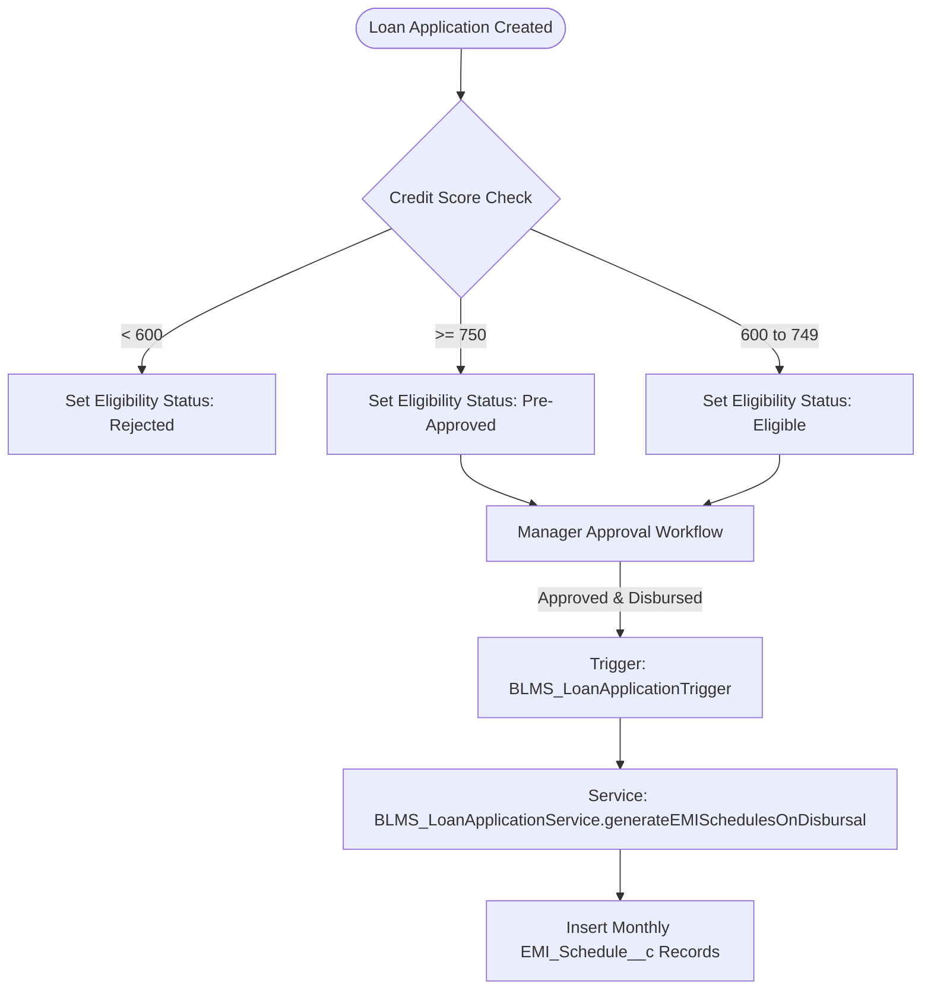

# Automation & Business Workflows - BLMS

## Overview
BLMS utilizes record-triggered triggers, service layers, scheduled batches, and approval processes to streamline loan management.

---

## 1. Credit Qualification & EMI Generation Workflow

---

## 2. Payment Allocation Engine

When a customer submits a `Payment__c` with status `Completed`:
1. `BLMS_PaymentTrigger` delegates to `BLMS_PaymentService.processIncomingPayments`.
2. The service queries all unpaid `EMI_Schedule__c` records ordered by `EMI_Number__c ASC`.
3. It allocates the payment amount sequentially to settle outstanding installments, marks settled EMIs `Is_Paid_Flag__c = true`, updates `Paid_Date__c`, and updates the parent `Loan_Application__c` total paid metrics.
