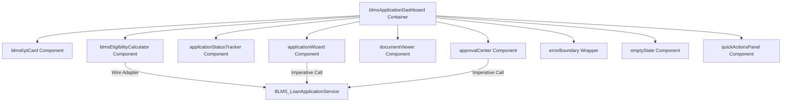

# Lightning Web Components (LWC) Architecture - BLMS

## Overview
The BLMS frontend is structured using modular, responsive Lightning Web Components following Salesforce Lightning Design System (SLDS) standards and reactive wire patterns.

---

## 1. LWC Component Hierarchy Diagram

---

## 2. Component Inventory

| Component Name | Description | Key Features |
| :--- | :--- | :--- |
| `blmsApplicationDashboard` | Executive Loan Console | Live KPI metrics, filterable loan tables, real-time reactive status cards |
| `blmsEligibilityCalculator` | Loan Eligibility Widget | Interactive tenure, loan amount, and interest sliders with instant EMI calculation |
| `blmsKpiCard` | Metric Display Card | Visual card for key portfolio indicators (Active Loans, Disbursed Volume, Overdue EMI) |
| `applicationWizard` | Guided Intake Wizard | Multi-step form for customer details, loan request, and guarantor entry |
| `applicationStatusTracker` | Visual Stage Indicator | Progress tracker showing loan state from Draft to Disbursed |
| `documentViewer` | KYC Document Viewer | Preview, download, and verify submitted customer identity and income proof docs |
| `approvalCenter` | Risk Approval Console | One-click approve/reject interface for Credit Officers and Branch Managers |
| `quickActionsPanel` | Action Bar | Shortcuts for rapid payment creation, customer lookup, and report export |
| `emptyState` | Reusable UI Component | Fallback display for empty search results or zero records |
| `errorBoundary` | Fault Handler Component | Graceful exception wrapper for LWC rendering runtime errors |
